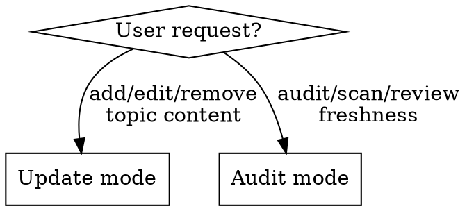
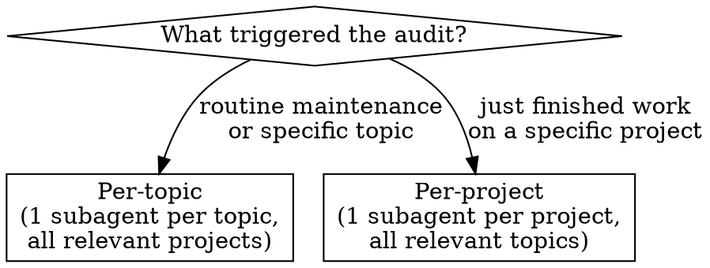

# Design Corpus Maintenance

Update and audit the design corpus stored at `home/dot_claude/corpus/`.

## Modes



---

## Update Mode

Structured manual editing of corpus topic files.

### When to Use

- Add a new convention or pattern
- Update an existing entry with new information
- Add/remove/update exemplar references
- Resolve an Open Question
- Add a new topic file to the corpus

### Process

1. **Identify the target topic** from `home/dot_claude/corpus/INDEX.md`
2. **Read the current topic file** from `home/dot_claude/corpus/<category>/<topic>.md`
3. **Present current state** to the user — show what's there now
4. **Propose changes** with before/after for the relevant section
5. **Apply changes** after user approval
6. **Update `last_audited` date** in frontmatter to today's date
7. **Update INDEX.md** if the one-line summary changed or a new topic was added

### Adding a New Topic

1. Determine category and slug
2. Create stub using the template in `./finding-schema.md`
3. Add entry to `home/dot_claude/corpus/INDEX.md` in the correct category section
4. Fill initial content based on user input

---

## Audit Mode

Subagent-driven discovery of patterns across real projects.

### Discovery Sources

**Primary — local projects (preferred):**
```bash
ls ~/projects/
```
Read the directory listing directly. Each subdirectory is a project.

**Secondary — GitHub API (rate-limit aware):**
```bash
# Check rate limit first
gh api rate_limit --jq '.resources.core.remaining'
# Then list repos
gh repo list Xevion --limit 100 --json name,primaryLanguage,updatedAt
```
Use for supplemental metadata (language, recent activity). Do not rely on this as the primary source.

**Manual specification:**
The user can directly name repos or topics to audit.

### Batching Strategy

Ask the user which approach to use each time:



**Per-topic batching:**
- One Sonnet subagent per corpus topic
- Each subagent receives the full topic file + list of project directories to check
- Best for: routine maintenance, auditing specific topics across the portfolio

**Per-project batching:**
- One Sonnet subagent per project
- Each subagent receives all relevant corpus topic files + the project directory
- Best for: post-project audits, comprehensive review of a single project

### Dispatching Subagents

Use the prompt template in `./auditor-prompt.md`. Key points:

- **Model:** Dispatch with `model: "sonnet"` for cost efficiency
- **Input:** Paste full corpus topic content into the prompt (don't make subagents read corpus files)
- **Projects:** Pass directory paths, not repo names — subagents read `~/projects/` directly
- **File discovery:** Subagents get the canonical file tree first, then scan including gitignored files
- **Output:** Structured YAML findings per `./finding-schema.md`

### Subagent File Scanning Rules

Subagents MUST:
1. Get the canonical git-tracked tree: `git ls-files` (or `fd -H --type f` if not a git repo)
2. Be **aware** of what's gitignored (know which files are outside git tracking)
3. **NOT skip gitignored files** — scan everything, including:
   - AI rulesets: `.claude/`, `.cursor/`, `.github/copilot/`, CLAUDE.md, .cursorrules
   - Local configs: .env.example, docker-compose.yml, Justfile, Makefile
   - Build configs: Cargo.toml, package.json, build.gradle.kts, pyproject.toml
4. Batch reads in parallel — dispatch multiple Read calls simultaneously

### Review Phase

After all subagents return:

1. **Aggregate findings** from all subagents into a single list
2. **Deduplicate** findings that overlap (same pattern found across multiple projects)
3. **Group by topic** for presentation clarity
4. **Present summary** to user — finding counts per topic, high-level overview
5. **Per-finding review** using the Question tool:
   - Approve (apply to corpus as-is)
   - Modify (adjust before applying)
   - Reject (discard)
6. **Apply approved changes** to the corpus topic files in `home/dot_claude/corpus/`
7. **Update `last_audited`** dates on all touched topics

### Scope Controls

| Scope | What gets checked |
|-------|-------------------|
| Full audit | All topics, all projects (expensive) |
| Topic-focused | Specific topics, all projects |
| Project-focused | Specific projects, all topics |
| Targeted | Specific topics, specific projects |

Default to targeted or topic-focused. Full audits should be rare.
