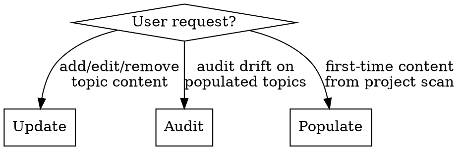

# Design Corpus Maintenance

Update and audit the design corpus stored at `home/dot_claude/corpus/`.

## Modes



**Mode selection heuristic:**
- User says "update/add/edit/remove" a specific convention → **Update**
- User says "audit/scan/review" against projects AND topics have real content → **Audit**
- User says "audit/scan" against projects AND topics are stubs (HTML comment placeholders) → **Populate**
- Auto-detect: read the target topics. If most sections are HTML comment placeholders, suggest Populate instead of Audit

---

## Update Mode

Structured manual editing of corpus topic files.

### When to Use

- Add a new convention or pattern
- Update an existing entry with new information
- Add/remove/update exemplar references
- Resolve an Open Question
- Add a new topic file to the corpus

### Process

1. **Identify the target topic** from `home/dot_claude/corpus/INDEX.md`
2. **Read the current topic file** from `home/dot_claude/corpus/<category>/<topic>.md`
3. **Present current state** to the user — show what's there now
4. **Propose changes** with before/after for the relevant section
5. **Apply changes** after user approval
6. **Update `last_audited` date** in frontmatter to today's date
7. **Update INDEX.md** if the one-line summary changed or a new topic was added

### Adding a New Topic

**When to create a new topic:**
- Pattern is observed in 2+ projects, OR the user explicitly wants it tracked
- The pattern doesn't fit naturally into any existing topic
- There's enough substance for at least 3-4 conventions (not just one bullet point)

**When to fold into an existing topic instead:**
- Pattern is a sub-concern of an existing topic (e.g., a specific SQL technique belongs in `sql.md`, not its own topic)
- Only observed in one project and isn't clearly generalizable yet — add as a convention or Open Question in the nearest topic
- Creating the topic would cause heavy overlap with an existing one

**Process:**
1. Determine category and slug
2. Create stub using the template in `./finding-schema.md`
3. Add entry to `home/dot_claude/corpus/INDEX.md` in the correct category section
4. Fill initial content based on user input

### Retiring or Merging Topics

When a topic turns out to be too narrow, overlaps excessively with another, or is no longer relevant:
1. Identify the target topic to merge into (or confirm deletion with user)
2. Migrate any non-redundant content to the target topic
3. Remove the old topic file
4. Update `INDEX.md` to remove the entry

---

## Populate Mode

First-time content generation for stub topics from real project scans. Use when topics exist but contain only placeholder comments.

### When to Use

- Topics are stubs with HTML comment placeholders instead of real content
- A new project was completed and the corpus hasn't been seeded from it yet
- Multiple new topics were created and need initial content

### How It Differs from Audit

| Aspect | Audit | Populate |
|--------|-------|----------|
| Topic state | Has real content | Stubs with placeholders |
| Subagent goal | Find drift/improvements | Discover patterns to write |
| Finding types | stale, improved, exemplar_update | Almost exclusively `new` |
| Review focus | Per-finding approve/reject | Structural decisions + batch approve |
| Interview questions | Rare (content exists) | Frequent (establishing conventions) |

### Process

1. **Rapid project profiling** — for each project, gather context quickly without reading every file:
   - `tokei ~/projects/<name>` for language breakdown and LOC
   - `fd -H --type f --max-depth 2 . ~/projects/<name>` for directory structure
   - Read CLAUDE.md / AGENTS.md / README.md for tech stack and conventions
   - `git -C ~/projects/<name> log --oneline -20` for recent activity
   - Identify which corpus topics are relevant based on languages and patterns observed
2. **Dispatch subagents** using the templates in `./auditor-prompt.md`, one subagent per project (not split by domain — splitting causes cross-subagent duplicates):
   - Include a brief project summary (from the profiling step)
   - List relevant topic NAMES and their file paths — let subagents read corpus files directly
   - Do NOT paste full corpus content into prompts (wastes tokens, bloats prompts)
3. **Aggregate and deduplicate** — merge findings that overlap across auditors (common with per-project batching)
4. **Interview-driven review** — mix structural brainstorming with finding approval:
   - **Structural questions first**: new topics needed? Cross-cutting patterns? Detail level? These shape how findings are applied
   - **Batch review via multi-select**: present findings grouped by theme, 4-6 per batch. Ask explicitly for confirmation — even in populate mode where most findings are valid, don't auto-approve
   - **Flag generalizations**: when a finding generalizes from a single project, ask whether the generalization is correct before writing it as a convention
   - **Mix brainstorming throughout**: when presenting a batch, ask about related structural decisions (e.g. "Should Svelte be its own topic or fold into TypeScript?")
5. **Write corpus content** — apply all approved findings, generalized into conventions:
   - Pattern descriptions + short illustrative snippets (3-5 lines, anonymized or using public project name)
   - Reference projects by name + module/type/function, not file paths (paths drift)
   - Add project as exemplar where it demonstrates a pattern well
6. **Update INDEX.md** with new entries and refreshed descriptions

### Interview Questions to Consider

During populate review, proactively raise questions like:
- "This finding doesn't fit existing topics. Should we create a new one?"
- "These findings span 3 topics. Should we duplicate from each perspective or cross-reference?"
- "This pattern is very project-specific. Should we generalize it or skip?"
- "The corpus has no [category] coverage yet. Should we add a topic for it?"

---

## Audit Mode

Subagent-driven discovery of drift, improvements, and new patterns across real projects. Use when topics already have real content.

### Discovery Sources

**Primary — local projects (preferred):**
```bash
ls ~/projects/
```
Read the directory listing directly. Each subdirectory is a project.

**Secondary — GitHub API (rate-limit aware):**
```bash
# Check rate limit first
gh api rate_limit --jq '.resources.core.remaining'
# Then list repos
gh repo list Xevion --limit 100 --json name,primaryLanguage,updatedAt
```
Use for supplemental metadata (language, recent activity). Do not rely on this as the primary source.

**Manual specification:**
The user can directly name repos or topics to audit.

### Rapid Project Profiling

Before dispatching subagents, profile each project quickly (do NOT read every corpus file — just list them from INDEX.md):

```bash
# For each project:
tokei ~/projects/<name>                              # Language breakdown + LOC
fd -H --type f --max-depth 2 . ~/projects/<name>     # Directory structure
cat ~/projects/<name>/CLAUDE.md                       # Tech stack + conventions (or README.md, AGENTS.md)
git -C ~/projects/<name> log --oneline -20            # Recent activity
```

This gives enough signal to determine which corpus topics are relevant to each project without reading the corpus files themselves.

### Batching Strategy

**Default: one subagent per project** with all relevant topics. Do NOT split a single project into domain groups — this causes cross-subagent duplicates and wastes tokens.

**Per-topic batching** (1 subagent per topic, all projects) is better for routine maintenance or auditing a specific topic.

**Always dispatch a gap analysis subagent** alongside audit subagents — it's cheap (~65s, ~68K tokens) and identifies missing topics that no audit subagent would catch.

### Dispatching Subagents

Use the prompt template in `./auditor-prompt.md`. Key points:

- **Model:** Dispatch with `model: "sonnet"` for cost efficiency
- **Lean prompts:** Do NOT paste full corpus topic content. Instead:
  - Provide topic names and their file paths (e.g., `home/dot_claude/corpus/languages/rust.md`)
  - For populated topics: include a 1-2 line summary of key conventions to look for
  - For stub topics: note they are stubs and the subagent should focus on `new` pattern discovery
  - Let subagents read corpus files directly — they're small (24-65 lines each)
- **Project context:** Include a brief project summary from the profiling step (tech stack, LOC, key dirs). Pass directory paths, not repo names
- **File discovery:** Subagents get the canonical file tree first, then scan including gitignored files
- **Output:** Structured YAML findings per `./finding-schema.md`

**Prompt size target:** ~100-150 lines per subagent prompt. If your prompt exceeds 200 lines, you're pasting too much content — summarize or let the subagent read it.

### Subagent File Scanning Rules

Subagents MUST:
1. Get the canonical git-tracked tree: `git ls-files` (or `fd -H --type f` if not a git repo)
2. Be **aware** of what's gitignored (know which files are outside git tracking)
3. **NOT skip gitignored files** — scan everything, including:
   - AI rulesets: `.claude/`, `.cursor/`, `.github/copilot/`, CLAUDE.md, .cursorrules
   - Local configs: .env.example, docker-compose.yml, Justfile, Makefile
   - Build configs: Cargo.toml, package.json, build.gradle.kts, pyproject.toml
4. Batch reads in parallel — dispatch multiple Read calls simultaneously

### Review Phase

After all subagents return:

1. **Aggregate findings** from all subagents into a single list
2. **Deduplicate** findings that overlap — especially cross-auditor duplicates from per-project batching. Merge findings with the same pattern into one, noting all source projects. **Present merged findings for confirmation** — don't silently apply dedup decisions
3. **Present summary** — finding counts per topic, high-level overview table
4. **Batch review** using the Question tool with multi-select:
   - Group findings by theme (not strictly by topic — related findings from different topics go together)
   - 4-6 findings per question for manageable review
   - **Ask explicitly** — present each batch for confirmation. Do not assume approval
   - Mix in structural/brainstorming questions when relevant (new topics, cross-cutting concerns)
   - When a finding generalizes a project-specific pattern, **ask whether the generalization is correct** rather than assuming it is
5. **Apply approved changes** to the corpus topic files in `home/dot_claude/corpus/`
6. **Update `last_audited`** dates on all touched topics
7. **Update INDEX.md** descriptions if content changed significantly

### Review Discipline

**Default to asking, not assuming.** The corpus encodes the user's real preferences — getting it wrong means future sessions act on false assumptions. Specific rules:

- **Never silently fold decisions into approvals.** If you're about to change tone, generalize a pattern, or consolidate duplicates, present that decision as a separate question
- **Flag project-specific vs. general.** When a finding comes from a single project, explicitly ask: "Is this a general convention or specific to this project?"
- **Flag prescriptive tone.** When writing conventions, prefer descriptive language ("prefer X", "use X when Y") over prescriptive ("always X", "X is non-negotiable") unless the user confirms the stronger framing
- **Don't batch too aggressively.** 4-6 findings per question. Larger batches cause users to skim and approve things they'd otherwise push back on
- **Conflicting conventions between projects** must be flagged during review for the user to decide — never auto-resolve by picking one

### Scope Controls

| Scope | What gets checked |
|-------|-------------------|
| Full audit | All topics, all projects (expensive) |
| Topic-focused | Specific topics, all projects |
| Project-focused | Specific projects, all topics |
| Targeted | Specific topics, specific projects |

Default to targeted or topic-focused. Full audits should be rare.

---

## Content Conventions

These apply when writing or updating corpus content in any mode.

### Detail Level

- **Pattern descriptions**: prose explaining the convention and why it matters
- **Short illustrative snippets**: 3-5 line code blocks showing the pattern shape. Anonymize if the project is private; use the real project name if public
- **No file path references in corpus**: reference by project name + module/type/function (e.g. "Banner's `ServiceManager`" not "src/services/manager.rs"). Paths drift; names are stable
- **Exemplars in frontmatter**: use `repo: Xevion/project-name` for public repos, `repo: local/project-name` for private. Path field references the module/directory, not a specific file

### Cross-Topic Patterns

When a pattern spans multiple topics (e.g. ts-rs touches rust, typescript, api-design, repo-layout):
- **Duplicate from each topic's perspective** — write the pattern as it relates to that topic specifically
- Each topic is self-contained; readers shouldn't need to cross-reference to understand a convention
- The `cross_topics` field in findings helps identify these during review

### Generalization

- Extract the underlying preference, strip project-specific details
- "Banner uses UNLOGGED TABLE for scheduler timestamps" → "Use UNLOGGED TABLE for ephemeral app state where crash-loss is acceptable"
- If a pattern is only observed in one project and isn't clearly generalizable, note it as a convention with a caveat, or add it to Open Questions instead
