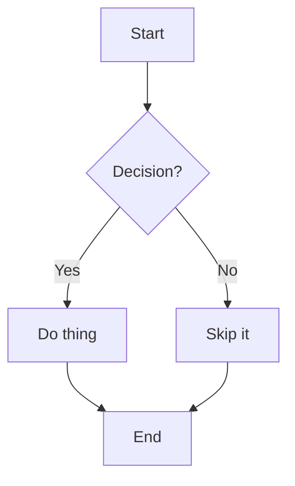
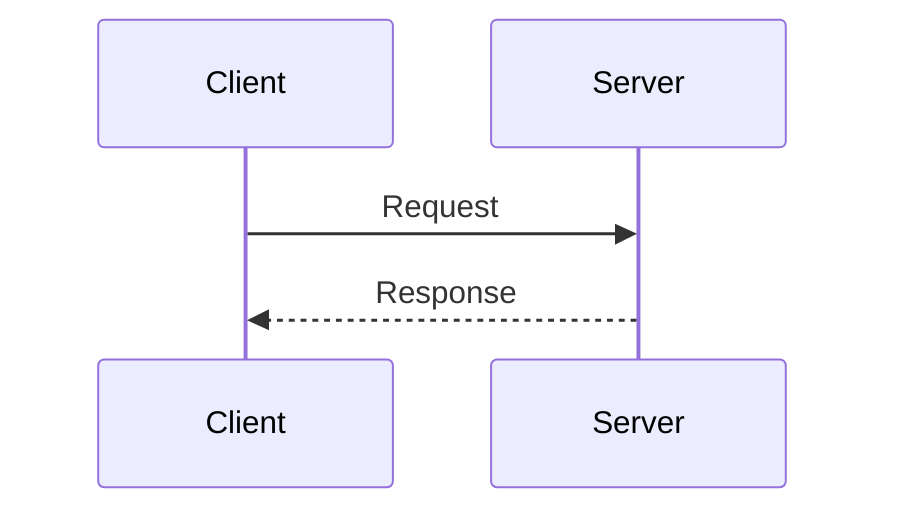
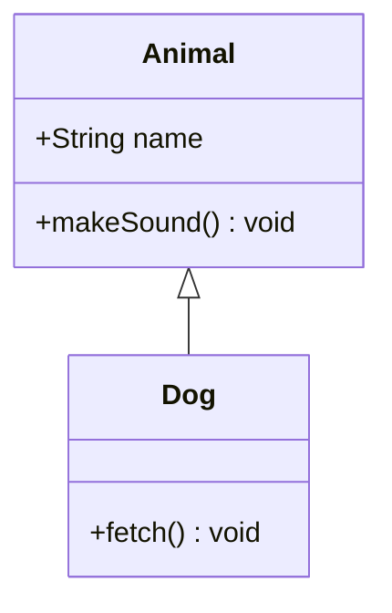
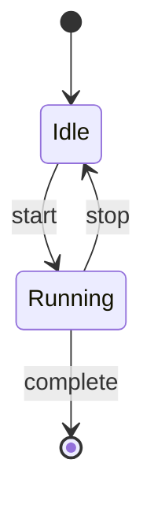
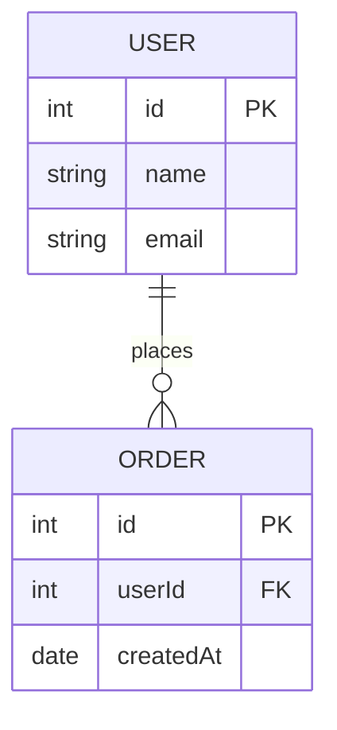

# Creating Diagrams

## Overview

Use **Mermaid** (` ```mermaid ` blocks) as the default tool for all diagrams. Mermaid is text-based, version-controllable, and renders natively on GitHub, GitLab, and Obsidian without any extra tooling.

**Note:** `writing-skills` uses Graphviz `.dot` blocks for skill process flowcharts — don't replace those. This skill covers documentation, READMEs, and visual explanations.

## Which Type to Use

| Situation | Diagram type |
| --- | --- |
| Steps, logic, branching, decision trees | `flowchart` |
| Messages/calls between actors or services | `sequenceDiagram` |
| Classes, interfaces, inheritance, composition | `classDiagram` |
| Object lifecycle, transitions between states | `stateDiagram-v2` |
| Database tables, foreign keys, relationships | `erDiagram` |

When in doubt, prefer `flowchart` — it handles most cases.

## Core Examples

### Flowchart



Use `TD` (top-down) for processes. Use `LR` (left-right) for pipelines and data flows.

### Sequence Diagram



Use `-->>` for return/response arrows. Use `->>` for forward calls.

### Class Diagram



### State Diagram



### ER Diagram



## Conventions

- **Size:** Keep diagrams under ~15 nodes. Split large diagrams rather than cramming.
- **Labels — actions:** Verb-first. `"Process request"`, `"Validate input"`, `"Send response"`.
- **Labels — states/nodes:** Noun or noun phrase. `"Idle"`, `"Error"`, `"Order placed"`.
- **Layout:** Prefer `TD` for top-down processes, `LR` for left-to-right pipelines.
- **Subgraphs:** Use sparingly. Nesting more than one level deep hurts readability.
- **One diagram, one idea:** If a diagram needs a legend to be understood, it's too complex.

## Platform Rendering

| Platform | Renders? |
| --- | --- |
| GitHub (`.md` files) | Yes, natively |
| GitLab | Yes, natively |
| Obsidian | Yes, natively |
| VS Code | Needs Mermaid Preview extension |
| Plain markdown viewers | No — use [mermaid.live](https://mermaid.live) to preview |

When the rendering target is unknown, mention this in a note or provide a `mermaid.live` link.

## Extended Reference

For advanced syntax (subgraphs, notes, actor aliases, relationship modifiers, styling), see `reference.md` in this directory.
