# Mermaid Syntax Reference

Extended syntax for the five core diagram types. See `SKILL.md` for minimal examples and when to use each type.

---

## Flowchart

### Node shapes

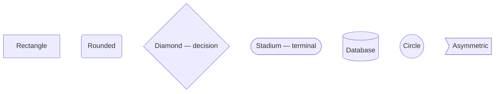

### Edges

```mermaid
flowchart LR
    A --> B          %% Arrow
    A --- B          %% Line, no arrow
    A -.-> B         %% Dotted arrow
    A ==> B          %% Thick arrow
    A -- label --> B %% Labeled arrow
    A -->|label| B   %% Alternate label syntax
```

### Subgraphs

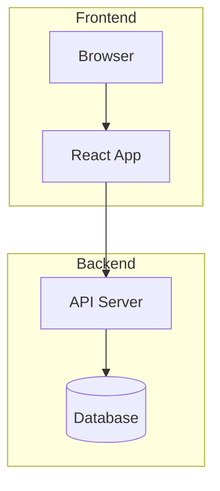

Subgraph IDs can be used as edge targets: `Frontend --> Backend`.

### Direction per subgraph

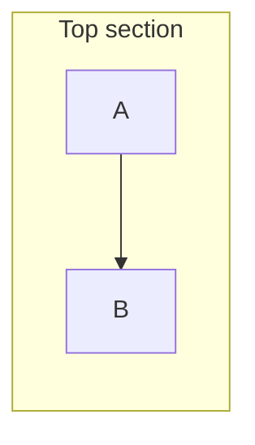

---

## Sequence Diagram

### Participant types

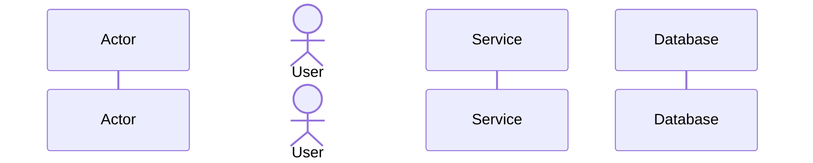

Use `actor` for human participants, `participant` for systems.

### Message types

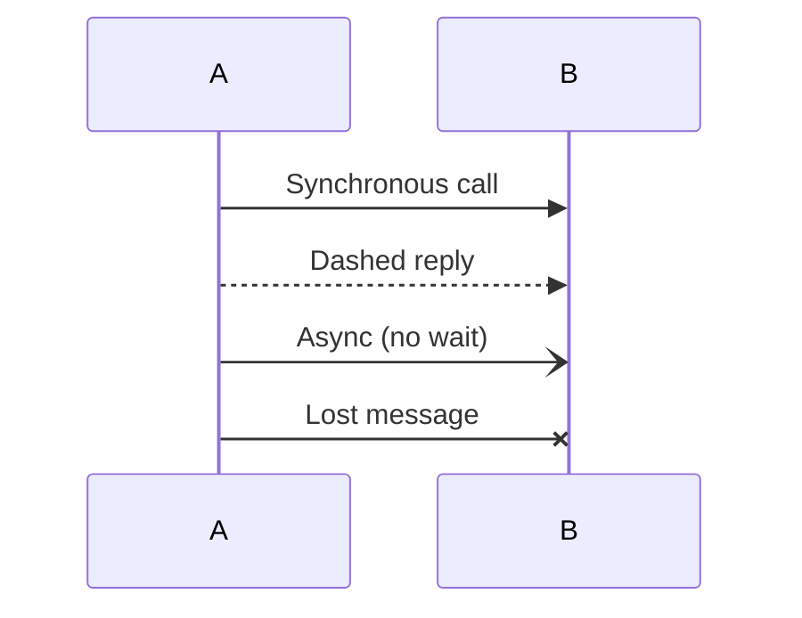

### Activation bars, notes, loops

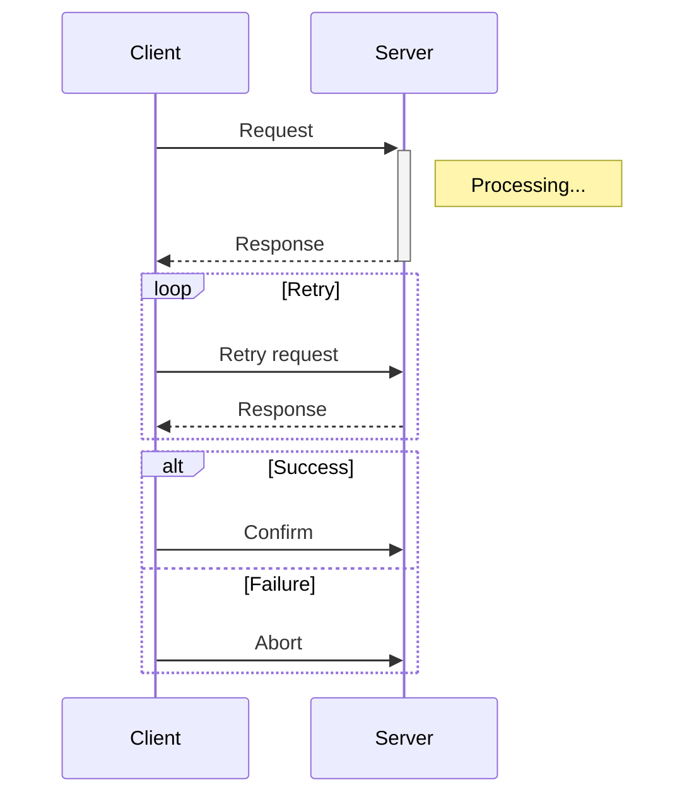

`+` activates the lifeline, `-` deactivates it.

### Fragments reference

| Fragment | Purpose |
| --- | --- |
| `loop <label>` | Repetition |
| `alt <condition>` / `else` | Conditional branches |
| `opt <condition>` | Optional block |
| `par` / `and` | Parallel execution |
| `critical` / `option` | Critical region |
| `break <condition>` | Break out of loop |

---

## Class Diagram

### Visibility modifiers

| Symbol | Meaning |
| --- | --- |
| `+` | Public |
| `-` | Private |
| `#` | Protected |
| `~` | Package/internal |

### Relationships

```mermaid
classDiagram
    ClassA <|-- ClassB       %% Inheritance
    ClassA *-- ClassC       %% Composition
    ClassA o-- ClassD       %% Aggregation
    ClassA --> ClassE       %% Association
    ClassA ..> ClassF       %% Dependency
    ClassA ..|> ClassG      %% Realization (implements interface)
    ClassA -- ClassH        %% Link (solid, no direction)
```

### Labels and cardinality

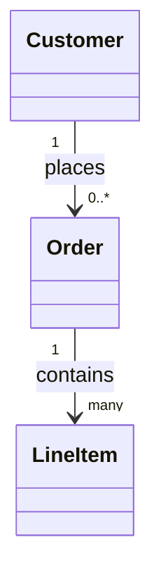

### Generics

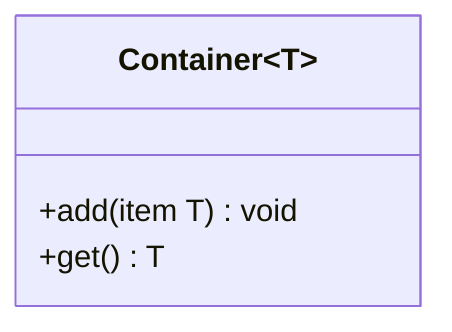

---

## State Diagram

### Composite states

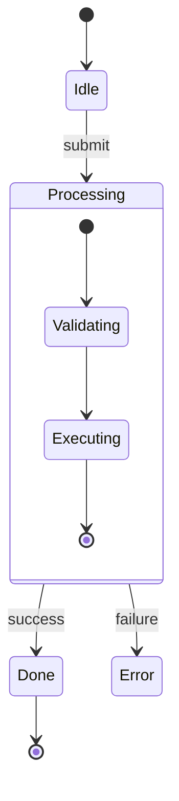

### Concurrency (parallel states)

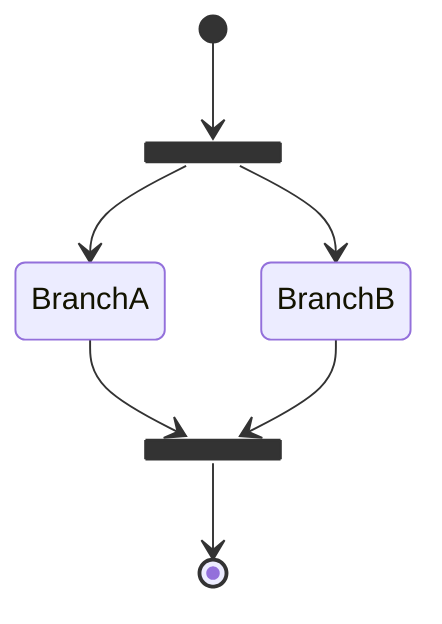

### Notes

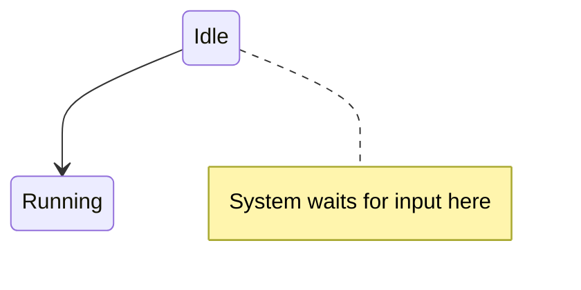

---

## ER Diagram

### Relationship notation

```
||--||   Exactly one to exactly one
||--o{   One to zero or more
||--|{   One to one or more
o{--o{   Zero or more to zero or more
```

### Full attribute syntax

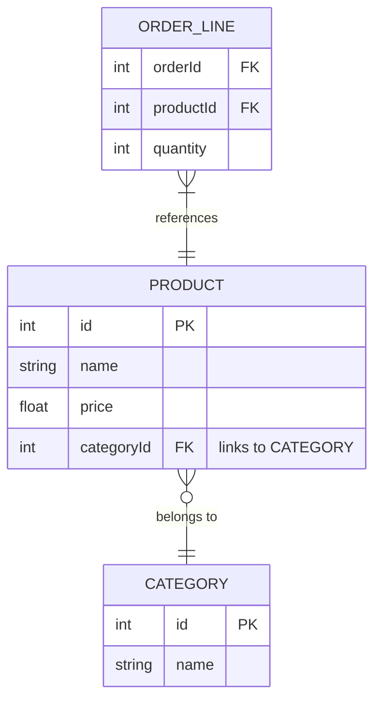

Supported attribute types: `int`, `string`, `float`, `boolean`, `date`, `datetime`. These are display-only — not enforced.

---

## Styling

Mermaid supports inline `style` and `classDef` for node colors. Use sparingly — diagrams should communicate through structure, not decoration.

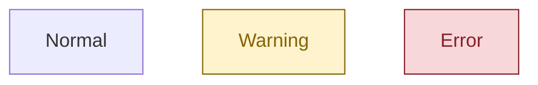

Avoid per-node `style` inline declarations — `classDef` is easier to maintain when multiple nodes share a style.
