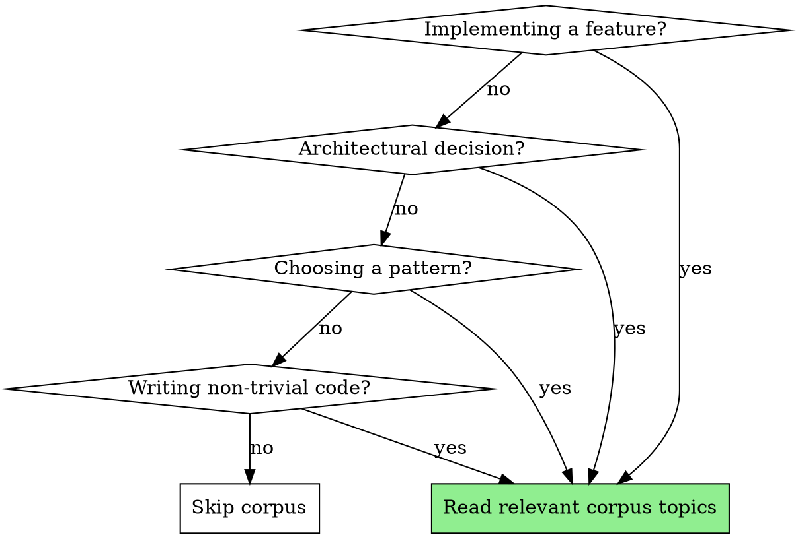

# Design Corpus

Read-only reference of preferred design patterns, conventions, and approaches across all projects.

## How It Works

The corpus lives at `~/.claude/corpus/`. An index summarizes every topic. Read specific topic files on demand based on the current task — do not load everything upfront.

## When to Consult

## Usage

1. **Read the index** at `~/.claude/corpus/INDEX.md` to identify relevant topics
2. **Read topic files** at `~/.claude/corpus/<category>/<topic>.md` for the ones that apply
3. **Apply conventions** from Philosophy and Conventions sections as defaults
4. **Note exemplar repos** — mention them if the user is working on a similar problem
5. **Flag Open Questions** if the task touches an unresolved area

## Rules

- **Read-only.** Never modify corpus files during a project session. Updates happen through the `design-corpus-maintain` skill in the chezmoi repo.
- **Lazy loading.** Only read topics relevant to the current task. The index tells you which ones matter.
- **Conventions are defaults, not mandates.** If a project has its own CLAUDE.md or conventions that conflict, project-local conventions win.
- **Mention conflicts.** If the project diverges from corpus conventions, mention it briefly — the user may want to update the corpus or the project.
- **Exemplars are references.** Don't read exemplar files unless the user asks. Just mention them as pointers.
- **Stubs are fine.** Some topics may only have placeholder content (HTML comments). Skip those — they'll be filled in through audits over time.
